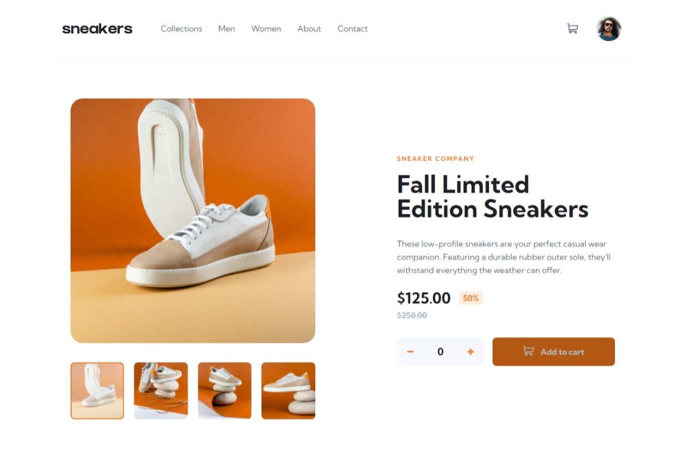

# Frontend Mentor - E-commerce product page solution

This is a solution to the [E-commerce product page challenge on Frontend Mentor](https://www.frontendmentor.io/challenges/ecommerce-product-page-UPsZ9MJp6). Frontend Mentor challenges help you improve your coding skills by building realistic projects.

## Table of contents

- [Overview](#overview)
  - [The challenge](#the-challenge)
  - [Screenshot](#screenshot)
  - [Links](#links)
- [My process](#my-process)
  - [Built with](#built-with)
  - [Continued development](#continued-development)
  - [Useful resources](#useful-resources)
- [Author](#author)

## Overview

### The challenge

Users should be able to:

- View the optimal layout for the site depending on their device's screen size
- See hover states for all interactive elements on the page
- Open a lightbox gallery by clicking on the large product image
- Switch the large product image by clicking on the small thumbnail images
- Add items to the cart
- View the cart and remove items from it

### Screenshot

### Links

- Solution URL: [https://github.com/P4P1-ND/ecommerce-product-page](https://github.com/P4P1-ND/ecommerce-product-page)
- Live Site URL: [https://p4p1-nd.github.io/ecommerce-product-page/](https://p4p1-nd.github.io/ecommerce-product-page/)

## My process

### Built with

- Semantic HTML5 markup
- CSS Grid
- Keyboard Accessibility
- Mobile-first workflow
- [Vite](https://vitejs.dev/) - Next Generation Frontend Tooling
- [Vue 3](https://v3.vuejs.org/) - The Progressive JavaScript Framework
- [Windi CSS](https://windicss.org/) - Next generation utility-first CSS framework

### Continued development

- [ ] Work on my **Atomic Design** file organization
- [ ] Use PWA
- [ ] Full switch to typescript

### Useful resources

- [How to organize your components using the Atomic Design](https://dev.to/sanfra1407/how-to-organize-your-components-using-the-atomic-design-dj3) - This blogpost explains how to organize your components in **atoms**, **molecules** and **organisms**.
- [Ensure text remains visible during webfont load](https://web.dev/font-display/?utm_source=lighthouse&utm_medium=devtools) - This show how to leverage the `font-display` CSS feature to ensure text is user-visible while webfonts are loading.
- [Serving AVIF Images](https://codelabs.developers.google.com/codelabs/avif#0) - This codelab demonstrates how to create & use AVIF format for our large sized images.
- [Detect click outside element](https://stackoverflow.com/questions/36170425/detect-click-outside-element#answer-64698630) - I used this stackoverflow answer to close the cart menu when the user clicks away.
- [Emancipate yourself from Vuex with Vue 3's Composition API](https://dev.to/thomasferro/emancipate-yourself-from-vuex-with-vue-3-s-composition-api-3b9g) - This great article written by [Thomas Ferro](https://dev.to/thomasferro) explains how to create your own state management with Vue 3's composition API.
- [How to Apply Nested Transitions in Vue](https://medium.com/@Taha_Shashtari/how-to-apply-nested-transitions-in-vue-d3a9fe1e1c98) - This is an amazing article which helped me understand Nested Transitions in Vue.

## Author

- Frontend Mentor - [@P4P1-ND](https://www.frontendmentor.io/profile/P4P1-ND)
